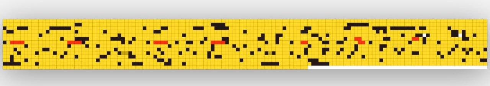
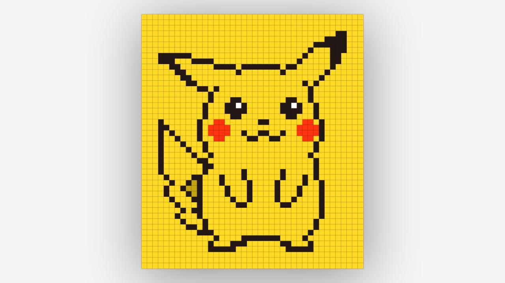

# Pikachu Pixel CSS

Trying to create pixel art Pikachu in pure CSS. (Not SCSS, Without JS)

Demo: https://basemax.github.io/PikachuPixelCSS/figure.html

I did not access to **Photoshop** or graphical software, but if you has access it can help you do it sooner.

------

### Other Similar Art Projects

I'm not a artist, it was just a try to follow some related figure.

- https://codepen.io/alkshendra/pen/NxRXZB
- https://codepen.io/una/pen/oXXRgg/
- https://codepen.io/andrewarchi/pen/OXEEgL
- https://codepen.io/MyXoToD/pen/fvnek/
- https://codepen.io/cx20/pen/qEibr/
- https://codepen.io/servinnissen/pen/yYbmrm
- https://codepen.io/msanz/pen/jbMXwq/

---------

# Max Base

My nickname is Max, Programming language developer, Full-stack programmer. I love computer scientists, researchers, and compilers. ([Max Base](https://maxbase.org/))

## Asrez Team

A team includes some programmer, developer, designer, researcher(s) especially Max Base.

[Asrez Team](https://www.asrez.com/)

